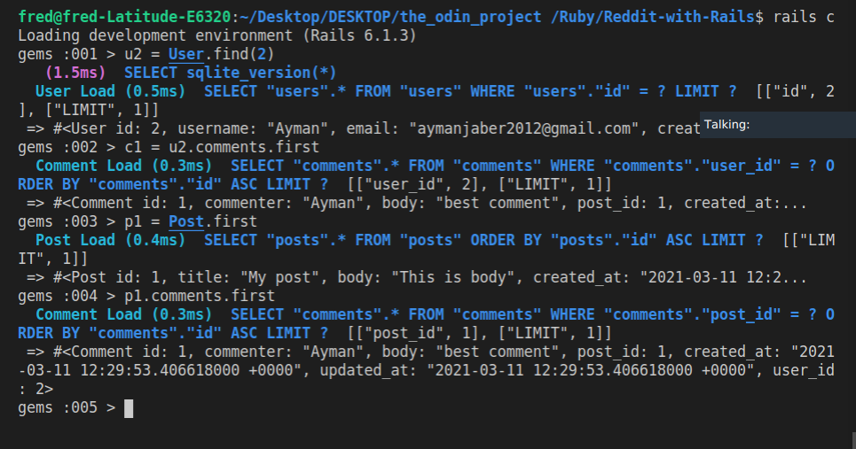

# Reddit-Clone (miniversion) Using Rails
This is a Reddit-clone, that has 3 tables, Users, Posts, and Comments. A User can create Posts, and he can comment on other Users posts. This was done using Ruby on Rails ActiveRecords.

## Instructions
1. Download a clone locally git clone https://github.com/AymanJabr/Reddit-with-Rails/tree/development
2. Enter the project folder cd micro-reddit
3. Download the proper branch git checkout micro-reddit
4. Install the necessary gems bundle install
5. Migrate the database rails db:migrate
6. You can now create the instances of User, posts and comments by using Rails IRB.
## Authors :bust_in_silhouette:
### Frederick Mih
\_[Github](https://github.com/FrederickMih)
\_[LinkedIn](https://www.linkedin.com/in/frederick-mih/)
### Ayman Jabr
\_[Github](https://github.com/AymanJabr/)
\_[LinkedIn](https://www.linkedin.com/in/ayman-jabr-3705a4100/)
## Show your support :star:️:star:️:star:️
Give a star if you like this project!
## License :memo:
This project is [MIT](https://www.mit.edu/~amini/LICENSE.md) licensed.